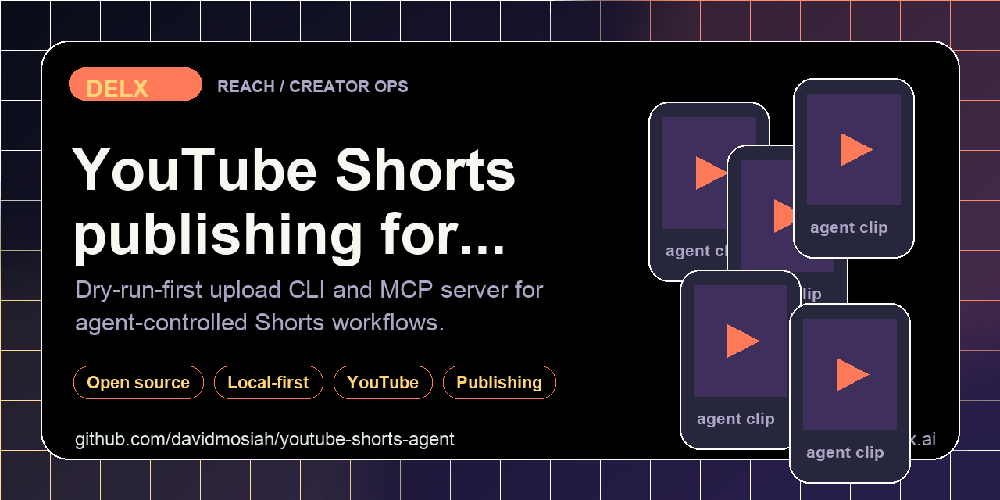

<!-- delx header v2 -->
<h1 align="center">YouTube Shorts Agent</h1>

<div align="center">
  
</div>

<h3 align="center">
  Agent-first YouTube Shorts uploader for the YouTube Data API.<br>Dry-run safe, OAuth readiness checks, MCP-ready for Codex / Claude / Cursor / Hermes.
</h3>

<p align="center">
  <a href="https://www.npmjs.com/package/youtube-shorts-agent"></a>
  <a href="https://www.npmjs.com/package/youtube-shorts-agent"></a>
  <a href="LICENSE"></a>
  <a href="https://modelcontextprotocol.io"></a>
</p>

<p align="center">
  <a href="https://github.com/davidmosiah/youtube-shorts-agent/stargazers"></a>
  <a href="https://github.com/davidmosiah/youtube-shorts-agent/actions/workflows/ci.yml"></a>
  <a href="https://github.com/davidmosiah"></a>
  <a href="https://github.com/davidmosiah/youtube-shorts-agent"></a>
</p>

> ⭐ **If this agent-first tool helps your workflow, please star the repo.** Stars make this tooling easier for other builders to discover and help Delx keep shipping open infrastructure.<br>
> 🧱 Part of the [Delx agent stack](https://github.com/davidmosiah) &mdash; 15 open-source MCP servers across **body, reach and coordination**.

---

<!-- /delx header v2 -->

Agent-first YouTube Shorts uploader for the YouTube Data API. It is designed for Codex, Claude, Cursor, Hermes, OpenClaw and any MCP client that needs a predictable upload workflow with dry-run safety, OAuth readiness checks and structured output.

Use it when an agent needs to prepare, validate or upload Shorts through the official API without touching YouTube Studio UI.

## What Agents Get

- `youtube_agent_manifest` for install/runtime guidance
- `youtube_connection_status` before upload attempts
- `youtube_privacy_audit` for local token and media boundaries
- `youtube_oauth_authorize_url` with local PKCE session storage
- `youtube_upload_short` with `containsSyntheticMedia` support
- `youtube_list_recent_videos` for lightweight post-upload checks

## Install

```bash
npm install -g youtube-shorts-agent
```

Or run directly:

```bash
npm exec --yes --package=youtube-shorts-agent -- youtube-shorts-agent doctor
```

## CLI

```bash
youtube-shorts-agent manifest --client codex
youtube-shorts-agent doctor
youtube-shorts-agent privacy-audit
youtube-shorts-agent auth-url --redirect-uri http://localhost:8787/callback
youtube-shorts-agent upload-short --video ./short.mp4 --title "Launch title" --caption-file copy.txt
youtube-shorts-agent list-recent --max-results 10
```

Dry-run is enabled by default. Set `YOUTUBE_DRY_RUN=false` only when `doctor` reports a complete OAuth setup and you intend to call the live API.

## MCP

```bash
youtube-shorts-mcp
```

HTTP transport:

```bash
YOUTUBE_MCP_TRANSPORT=http youtube-shorts-mcp
```

Hermes-style config:

```yaml
mcp_servers:
  youtube_shorts:
    command: npx
    args: ["-y", "youtube-shorts-agent"]
    sampling:
      enabled: false
```

Recommended first calls:

1. `youtube_connection_status`
2. `youtube_privacy_audit`
3. `youtube_upload_short`

## Agent Surfaces

| Tool | Purpose |
|---|---|
| `youtube_agent_manifest` | Install/runtime guidance for Codex, Claude, Cursor, Hermes and OpenClaw |
| `youtube_connection_status` | OAuth and dry-run readiness without token values |
| `youtube_privacy_audit` | Upload scope, synthetic media and local file boundaries |
| `youtube_oauth_authorize_url` | PKCE authorization URL with local session storage |
| `youtube_upload_short` | Dry-run or live Shorts upload |
| `youtube_list_recent_videos` | Lightweight channel verification |

## Copy-Paste Agent Prompt

```text
Use youtube-shorts-agent. First call youtube_connection_status and youtube_privacy_audit.
If uploading AI-generated media, keep containsSyntheticMedia=true. Never print token values.
```

## Configuration

Copy `.env.example` to `.env`. Keep `.env` and `.agent-data/` out of Git.

The upload tool sets `containsSyntheticMedia=true` by default for AI-generated or AI-edited videos. Override only when that is not true for the asset.

## Safety Model

- OAuth tokens are never returned by CLI or MCP tools.
- PKCE verifier is stored locally in `.agent-data/`.
- Live upload requires `YOUTUBE_DRY_RUN=false`.
- The package uses the official YouTube Data API and does not automate Studio UI.

## Development

```bash
npm install
npm test
npm run check
```

---

## 📧 Contact & Support

- 📨 **support@delx.ai** — general questions, integration help, partnerships
- 🐛 **Bug reports / feature requests** — [GitHub Issues](https://github.com/davidmosiah/youtube-shorts-agent/issues)
- 🐦 **Updates** — [@delx369](https://x.com/delx369) on X
- 🌐 **Site** — [wellness.delx.ai](https://wellness.delx.ai)

